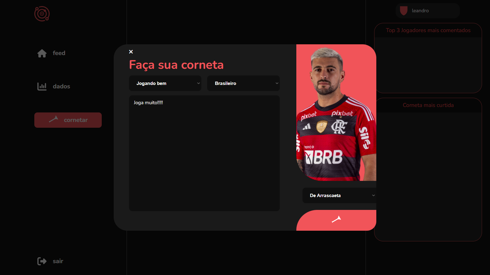
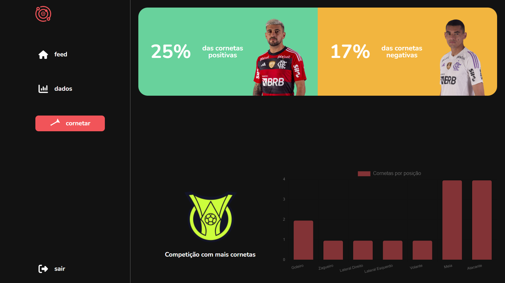
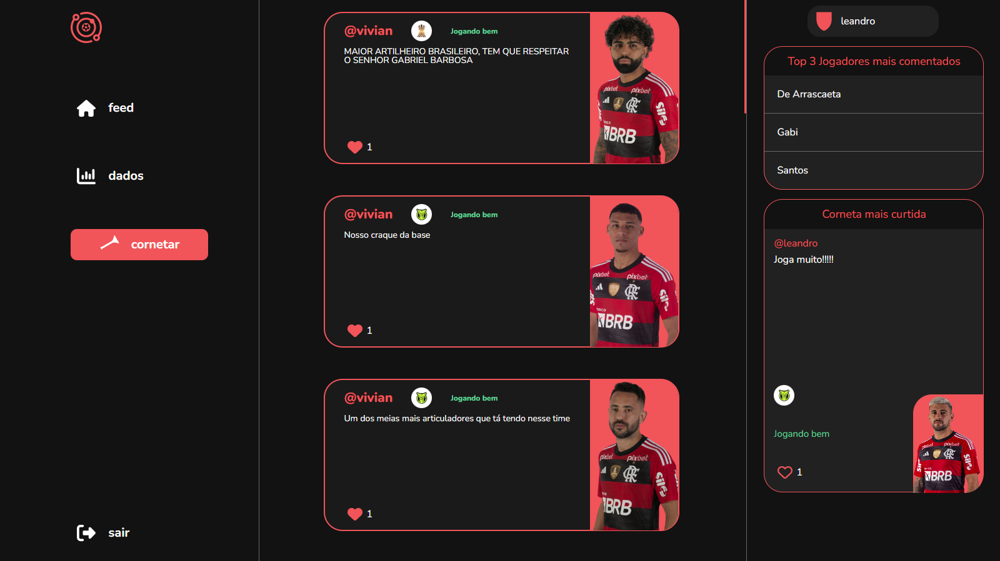
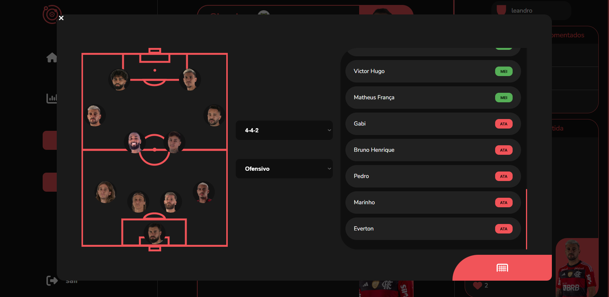
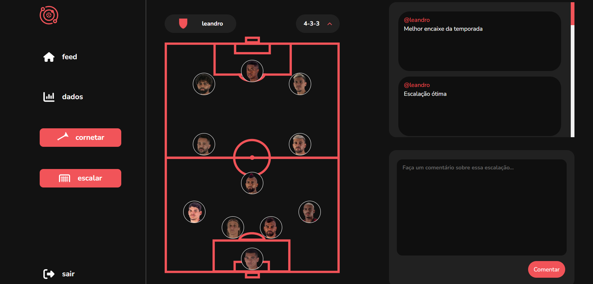

# spacefla

O spacefla é um espaço para comentar e avaliar a performance de um jogador em específico do time. Essa avaliação pode ser direcionada em uma competição específica ou ser considerada positiva ou negativa. Ao mesmo tempo que você comenta, você conseguirá ter acesso a um feed de comentários de outros usuários da plataforma, formando assim um espaço rubro-negro.

 

## Screenshot

    
